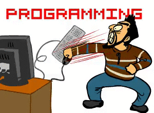

<style>
    .mamadfar {
        border-top-width: 1px;
        border-top-style: solid;
        border-color: inherit;
        border-radius: 4px;
        transition: border 0.3s;
    }
    .mamadfar:hover {
        border-bottom-width: 1px;
        border-bottom-style: solid;
        border-color: red;
    }
    .mamadfar__about {
        position: relative;
        display: flex;
    }
    .mamadfar__about span {
        position: relative;
        bottom: -1px;
        animation: mamadfar 4s ease-in-out infinite;
    }
    .mamadfar__about a {
        margin-left: auto;
        text-decoration: none;
    }
    .mamadfar__about img:first-child {
        margin-right: 5px;
    }
    @keyframes mamadfar {
        0% {
            bottom: -3px;
        }
        20% {
            bottom: -5px;
        }
        40% {
            bottom: -7px;
        }
        60% {
            bottom: -9px;
        }
        80% {
            bottom: -11px;
        }
        100% {
            bottom: -1px;
        }
    }
</style>
<div class="mamadfar" style="display: flex; justify-content: center; flex-direction: column; align-items: center;">

### Hi there, this is Mohammad 

- 🌱 I’m currently learning and improving these knowledges: <u>**Web 3**</u>, <u>**Solidity**</u> , <u>**Next 13**</u>, and <u>**Node**</u>


- 👯 I’m looking to collaborate on anything 😊
- 📫 You can find many ways to reaching out to me here: [Mohammad](https://devsteam.ir/mohammad) 



</div>

<h4 class="mamadfar__about">  A little more about me<span>...</span><a href="https://www.linkedin.com/in/mamadfar/"></a></h4>

```ts
const ME: Omit<IMohammad, "badHabit"> = {
    pronouns: "He" | "Him",
    code: ["JavaScript", "TypeScript", "HTML", "CSS"],
    askMeAbout: ["web dev", "tech", "game", "anime"],
    technologies: {
        frontEnd: {
            js: ["React","Next", "Redux"],
            ui: ["Tailwind", "Ant Design", "Bootstrap", "SCSS"]
        },
        backEnd: {
            js: ["Node", "Express"],
        },
        familiar: {
            mobileApp: {
                js: ["React Native"]
            },
            frontEnd: ["vue", "angular", "astro"]
            devOps: ["AWS", "Docker🐳"],
            databases: ["mongo", "MySql"]
        }
    },
    architecture: ["Single page applications"],
    currentFocus: "Web 3 & Blockchain",
    funFact: "There are two ways to write error-free programs; only the third one works"
};
```